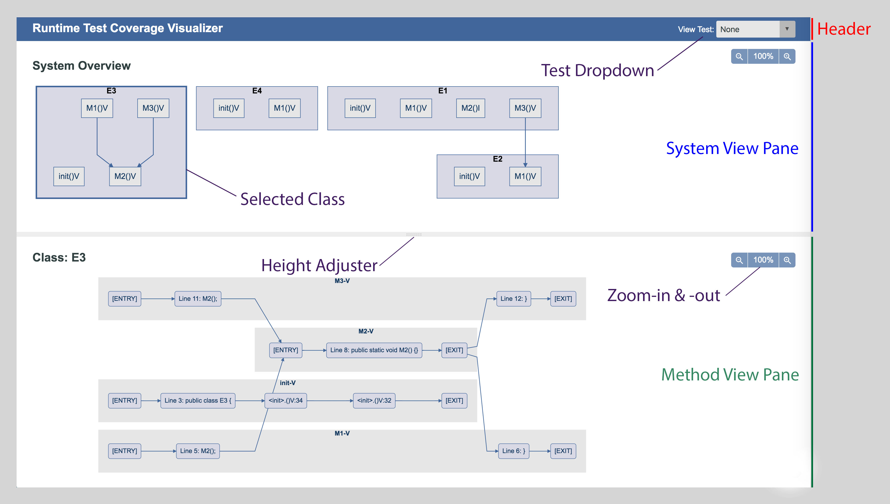

# Visualizing Runtime Test Coverage

## Table of content
  - [Abstract](#abstract)
  - [Introduction](#introduction)
  - [Implementation](#implementation)
    - [Runtime Trace Agent](#runtime-trace-agent)
    - [Web-Based Trace Visualizer](#web-based-trace-visualizer)
  - [Results](#results)
  - [Future Work](#future-work)
  - [Conclusion](#conclusion)

## Abstract

Software testing is critical for the success of the software, but the cost is normally high
for the task. With the help of testing frameworks, tests can be executed easily, but
creating high value test cases is still time consuming. Since the number of possible
tests for even simple software is seemingly infinite for all practical purposes, it becomes
necessary to use tooling that measures test coverage percentage to help decide when
there are ‘enough’ test cases.

## Introduction
In this project, the goal is to visualize the test coverage to provide more information to
the developer about the quality of their test suite. Here are the details:
- Statically generate call and control flow graphs of the software under test.
- At runtime, trace execution of a test to determine the path taken through the call
and control flow graphs.
- Present a UI allowing one to drill down into different levels of the software:
system view, class view and method view.
  - System view: displays all the class components of the system
  - Class view: displays all the methods in the class
  - Method view: displays control flow graph of the method
- Highlight the paths from each test execution on the UI as well and the control
flow path in the involved methods.

The visualization of the test execution provides the following advantages:
- Easily find code paths without tests
- Provide a better understanding of the test coverage beyond just a percentage
- Readily trace paths for the failed tests

## Implementation

### Runtime Trace Agent

### Web-Based Trace Visualizer
This is the User Interface for visualizing the call graph, control flow graph of a system and it also enables user to select desired test case and highlight the coverage of selected test, features includes:
- generate different views and graphs for a system
- options for highlighting individual test cases and overall test coverage
- zoom in out feature for graphs
- adjustable split pane for different views
- responsive layout

#### Data Source ####
The Visualizer requires a JSON file named `results.json` as the data source for generating different graphs. The JSON should has 4 major data in order to generate all the graphs and enable all the features of the UI:
- callGraph: generating call graph for all classes in the `System View Pane`
- contorlFlows: generating control flow graph for methods of all classes in the `Method View Pane`
- traceRecords: each record shows as an item on the `View Test Dropdown` and highlights the paths on the `System View Pane` and `Method View Pane` when the corresponding test is selected.
- globalToLocalNodeId: the mapping reference for all the nodes which contains details about the class and method that node belongs to.

#### UI Design ####
The visualizer aims to help provide an intuitive interface for the user to understand the system architecture better and visualizing test coverage at different layers. There are 3 sections in the UI:

- Header: it is the fixed position section at the top containing the name of the application and the `View Test Dropdown`. User can switch between each individual test case or simply select `all` for showing the overall test coverage of all test cases.
- System View Pane: it is the upper large pane for showing all the classes of the system along with edges between their methods, which representing the call graph of the system. Each class is clickable for changing content in the `Method View Pane`, the thick border around the class indicates the selected state of the class.
- Method View Pane: it is the bottom pane of the page for showing control flow graph of methods in the selected class.

#### Technologies ####
This web application is using webpack as the build tool for transpiling Javascript ES6 and pre-processing sass for styles in both development and production. Mermaid.js is the main Javascript library for graph generation, the version of Mermaid.js used in the project is slightly modified to better fit the need of all the designed interactions for improving user experience.

## Results
Show example classes and visualized results.

## Future Work
Talk about improvements we could make or features we could add.
- UI
  - inter-class method node connections: add edges between nodes of methods according to call graph
  - more scalable
  - browser support

## Conclusion
Summarize work and results.
