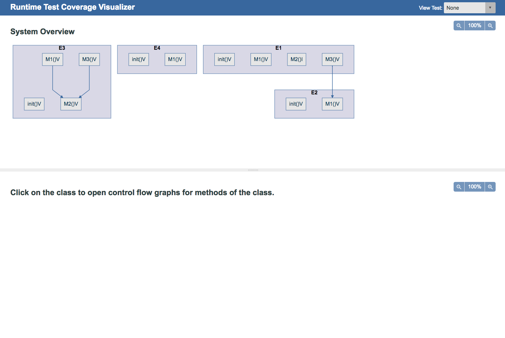
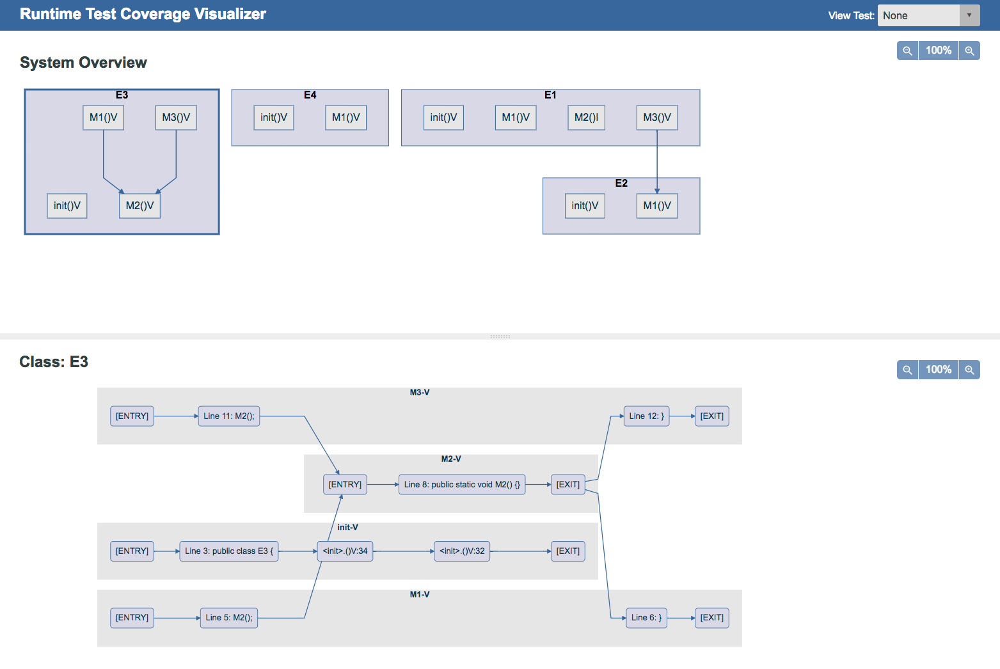
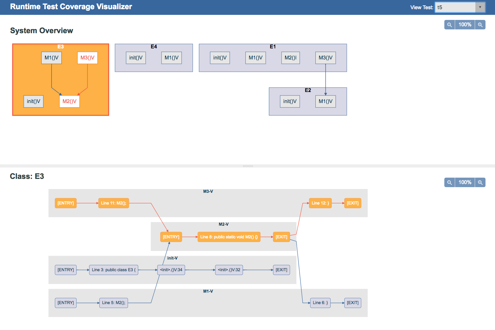
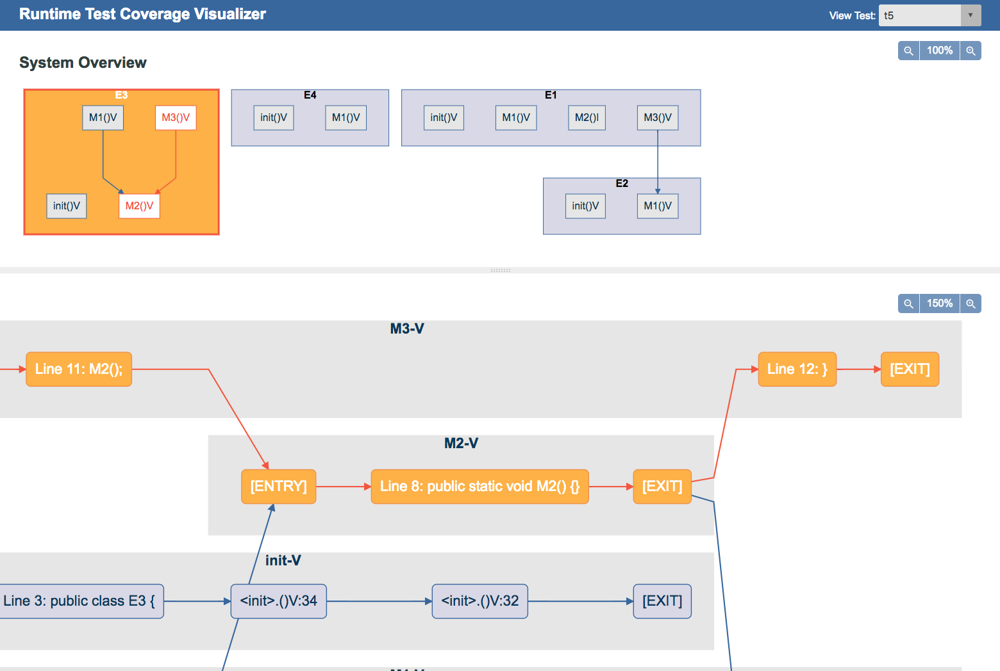

# Visualizing Runtime Test Coverage

## Table of content
- [Visualizing Runtime Test Coverage](#visualizing-runtime-test-coverage)
  - [Table of content](#table-of-content)
  - [Abstract](#abstract)
  - [Introduction](#introduction)
  - [Technique](#technique)
    - [Runtime Agent](#runtime-agent)
    - [Web-Based Trace Explorer](#web-based-trace-explorer)
      - [Data Source](#data-source)
      - [UI Design](#ui-design)
      - [Technologies](#technologies)
      - [Implementation Details](#implementation-details)
  - [Demonstration](#demonstration)
  - [Future Work](#future-work)
    - [Limitations](#limitations)
    - [Enhancements](#enhancements)
  - [Conclusion](#conclusion)

## Abstract

Software testing is critical for the success of the software, but the cost is normally high
for the task. With the help of testing frameworks, tests can be executed easily, but
creating high value test cases is still time consuming. Since the number of possible
tests for even simple software is seemingly infinite for all practical purposes, it becomes
necessary to use tooling that measures test coverage percentage to help decide when
there are ‘enough’ test cases.

## Introduction
In this project, the goal is to visualize the test coverage to provide more information to
the developer about the quality of their test suite. Here are the details:
- Statically generate call and control flow graphs of the software under test.
- At runtime, trace execution of a test to determine the path taken through the call
and control flow graphs.
- Present a UI allowing one to drill down into different levels of the software:
system view, class view and method view.
  - System view: displays all the class components of the system
  - Class view: displays all the methods in the class
  - Method view: displays control flow graph of the method
- Highlight the paths from each test execution on the UI as well and the control
flow path in the involved methods.

The visualization of the test execution provides the following advantages:
- Easily find code paths without tests
- Provide a better understanding of the test coverage beyond just a percentage
- Readily trace paths for the failed tests

## Technique
Our test coverage analysis tool comprises two primary components: a runtime agent for instrumenting and tracing the code under test and a web-based review tool for visualizing and exploring trace results. In general, the agent assumes a well-defined set of test methods that validates functionality is provided by the code under test. The agent will generate a new trace for each test method executed, and each trace records the execution path taken by the code under test.

We target code compiled for the Java 8 SE JVM and whose tests are implemented using the [JUnit 4](https://junit.org/junit4/) test framework. Nevertheless, the techniques described herein are applicable to other language environments in which source code compiles to an object code format (e.g., bytecode) that can be readily parsed and augmented through instrumentation prior to execution.

### Runtime Agent
Our runtime agent is implemented as a custom Java agent that is loaded by the JVM prior to the execution of a program's main method. The agent installs both a custom class file transformer and a runtime shutdown hook that executes just prior to the JVM terminating. Here _class file_ is taken to mean a sequence of bytes in the Java class file format as defined by sections [2.1](https://docs.oracle.com/javase/specs/jvms/se8/html/jvms-2.html#jvms-2.1) and [4](https://docs.oracle.com/javase/specs/jvms/se8/html/jvms-4.html) in the _Java Virtual Machine Specification: Java 8 SE Edition_. As such, our agent operates on the Java bytecode level as opposed to the Java source code level.

The agent is responsible for maintaining a trace record for each test method executed. Each record contains, among other things, a sequence of the bytecode instructions executed by the code under test. The agent delegates responsibility of the trace records to a global trace registry implemented using a [monostate pattern](http://wiki.c2.com/?MonostatePattern). The registry facilitates the creation and maintains the storage of all trace records during the lifetime of the agent. The use of a monostate simplified the task of class file transformation by distilling each instrumentation task down to a series of one or more static method calls.

Our agent's class file transformer is called by the JVM for each class loaded and defined at runtime. It allows the transformer an opportunity to modify the definition of the supplied class file prior to passing the modified bytecode back to the JVM for verification and application. A transformer may be selective in which parts, e.g., methods, of the class file it modifies, and it may choose to signal to the JVM that no modifications occurred by simply returning null.

Our class file transformer uses the [ASM bytecode manipulation framework](https://asm.ow2.io/) to instrument two sets of methods. The first are those marked with JUnit's `@Test` annotation. The start of these methods are augmented to create a new trace record by calling into our global trace registry. The newly created record becomes the _current_ or _active_ trace record, and the results of subsequent calls that record the instructions executed along a given path are stored within the current trace record.

The second set of methods instrumented by our class file transformer are those that belong to the code under test. The transformer identifies those classes to instrument by matching the fully qualified name of the class, i.e., class name prefixed with its package name, against a set of class name prefixes that are passed in as a configuration parameter to the runtime agent. If one of the class prefixes matches the name of the class passed to the transformer, then the transformer will instrument each of the class's methods.

For each method instrumented, a control flow graph is generated for the method and stored in the global trace registry. Conceptually each node represents an executable bytecode instruction within the method's definition, and each node is assigned a globally unique identifier for the current execution of the JVM. Each control flow graph is modified to include to pseudo-nodes representing well-defined entry and exit nodes respectively into and out of the method. These pseudo-nodes are also assigned globally unique identifiers and are used to simplify trace and control flow processing for the agent.

After constructing a method's control flow graph, for each node in the graph the class file transformer will add a call to the global trace registry to record the global ID of the node. The call for a given node is added immediately before the corresponding bytecode instruction is executed. Special handling is done to ensure the graph's pseudo-nodes are properly recorded as well. At runtime, this has the effect of producing a sequence of global node ID values corresponding to the exact execution path taken by the instrumented method, which is then recorded in the current trace record.

The transformer also uses a method's control flow graph to generate a partial call graph for the code under test. This partial call graph is recorded with the global trace registry for later processing. Once all methods under test have been instrumented, the complete call graph for the methods under test can be constructed.

In addition to generating a call graph, the class file transformer will also add instrumentation that is used to determine the sequence of method that are called during the execution of a given test method. The transformer augments a method's entry by inserting a call to record when the instrumented method has been entered. At the method's exit point, the transformer inserts a corresponding call to record when the instrumented method is about to return. At runtime, this information is forwarded to the current trace record which then uses it to construct the method call sequence.

If the code under test has been compiled with debug information and the runtime agent has been configured with the root directory containing the code, then the class file transformer will also annotate nodes in the control flow graph with their corresponding line of source code. This is used in the trace explorer to help map traces back to the lines of code actually executed by a JUnit test suite. If no source path is given or no debug information is available in the compiled bytecode, then nodes are identified in the trace explorer by their enclosing method and their node ID.

When the JVM terminates, the agent's shutdown hook is executed. During this time, the global trace registry serializes each trace record created at runtime, the call graph for the code under test, and the control flow graph for each method under test that was instrumented. Internal mapping state is also recorded so that the results stored in the previous three structures can be appropriately interpreted by downstream processors. All data is serialized to a JSON file in a format that is readily consumable by the web-based trace explorer.

### Web-Based Trace Explorer
This is the User Interface for visualizing the call graph, control flow graph of a system and it also enables user to select desired test case and highlight the coverage of selected test, features includes:
- generate different views and graphs for a system
- options for highlighting individual test cases and overall test coverage
- zoom in out feature for graphs
- adjustable split pane for different views
- responsive layout

#### Data Source
The Trace Explorer requires a JSON file named `results.json` as the data source for generating different graphs. The JSON should has 4 major data in order to generate all the graphs and enable all the features of the UI:
- callGraph: generating call graph for all classes in the `System View Pane`
- contorlFlows: generating control flow graph for methods of all classes in the `Method View Pane`
- traceRecords: each record shows as an item on the `View Test Dropdown` and highlights the paths on the `System View Pane` and `Method View Pane` when the corresponding test is selected.
- globalToLocalNodeId: the mapping reference  using a global id for all the nodes which contains details about the class and method that node belongs to.

#### UI Design
The Trace Explorer aims to help provide an intuitive interface for the user to understand the system architecture better and visualizing test coverage at different layers. There are 3 sections in the UI:

- Header: it is the fixed position section at the top containing the name of the application and the `View Test Dropdown`. User can switch between each individual test case or simply select `all` for showing the overall test coverage of all test cases.
- System View Pane: it is the upper large pane for showing all the classes of the system along with edges between their methods, which representing the call graph of the system. Each class is clickable for changing content in the `Method View Pane`, the thick border around the class indicates the selected state of the class.
- Method View Pane: it is the bottom pane of the page for showing control flow graph of methods in the selected class.

Apart from that, each node in the graph has it's own description, it shows the method name if the node represents a method and shows related line number and syntax if it's a node in a method. This can help user better associate the graph to the source code of the program.

Because of the screen size limitation, the graph generated for a complex system could too large to fit in the screen and readable at the same time. A zoom-in & -out feature for both panes is added to enlarge or minimize the graph according to the need of the user, plus svg vector graphics serves well for this purpose.

#### Technologies
This web application is using [webpack](https://webpack.js.org/) as the build tool for transpiling [Javascript ES6](https://developer.mozilla.org/en-US/docs/Web/JavaScript/New_in_JavaScript/ECMAScript_2015_support_in_Mozilla) and pre-processing [sass](https://sass-lang.com/) for styles in both development and production. [Mermaid.js](https://github.com/knsv/mermaid) is the main Javascript library for graph generation, and Mermaid.js has [d3](https://d3js.org/) and [dagre-d3](https://github.com/dagrejs/dagre-d3) as the dependencies for graphical layout and drawing libraries.
There're also some helper functions in the application for specific features. [split.js](https://nathancahill.github.io/Split.js/) helps to create the adjustable split panes on the page, and [he](https://github.com/mathiasbynens/he) encodes special characters to HTML entities, so they can be used as descriptions on the mehod nodes.

#### Implementation Details
As mentioned before, Mermaid.js is used for generating the call graphs and control flow graph, Mermaid takes a simple markdown-like script to do that. The challenge is to gather data from the data source and convert them into the Mermaid script and another challenge is to making the generated SVG graphs to be interactive. The original Mermaid library cannot archive the goal, We have to slightly modify it, so the elements in the graphs are generated with the desired attributes which make them selectable by Javascript for adding the highlighting effects as well as some transition effects.

The app first loops through  `controlFlows` object from the data source to build the class blocks and control flow graphs and then retrieves data from `callGraph` to build the edges between class blocks. Each element in the blocks and graph has a unique id composed from the JSON data and in the consistent format like this:
`System View Pane':
- class container: [classsName]
- method: [globalMethodId]
- call graph edge: [globalMethodId:from]-[globalMethodId:to]

`Method View Pane':
- method container: [methodName]-[methodDescriptor]
- method node: [globalNodeId]
- control flow graph edge: [globalNodeId:from]-[globalNodeId:to]

So each element can be selected individually, When a test is selected from the `Test Dropdown`, it takes global node ids from the `tracePath` of the `traceRecords` object, and select all the related elements and add the highlighting styles to them in order to show the actual test paths. Similarly, the `all` option on the `Test Dropdown` trigger the code to retrieve and highlight `tracePath` for all tests to show the overall coverage.

## Demonstration
This is a simple demonstration of the data source generated by the Trace Agent and it's result on the Trace Explorer.
<!-- links may need to update -->
- [Java code example](https://github.com/mvromer/EE360T/tree/master/ControlTracer/TraceDriver/src/ee360t/controlflow/trace/examples)
- [Test driver example](https://github.com/mvromer/EE360T/blob/master/ControlTracer/TraceDriver/src/ee360t/controlflow/trace/driver/App.java)
- [corresponding Trace Agent output](https://github.com/mvromer/EE360T/blob/master/ui/dist/results.json)

On the Trace Exploer:
1. Call graphs showing in the System View Pane with no control flow graph showing and no test selected

2. Click on one of the class block and have the methods in that class showing in the Method view Pane

3. Select a test from the Test Dropdown to highlight the test path on the graphs

1. Enlarge a comples graphs to view the details

## Future Work

### Limitations
Talk about improvements we could make or features we could add.
- Web-based Trace Explorer
  - inter-class method node connections: currently, inter-class connection can be view on the call graph level between methods of different classes, but not on control graph level, edges between method nodes of different classes should be available to indicate the actual method invoking path.
  - more scalable: even with the graph enlarging feature, it's not easy to look at class has 100+ method or method has 1000+ nodes. A more scalable designed UI may be needed for a wider application.
  - browser support: the way to read external JSON file is making a XMLHttpRequest request for the file, which works well if running the app on a server. There may be issues when a user open the `index.html` with browsers directly, browsers like Chrome blocks XMLHttpRequest to load a local file, but user ca use FireFox as a workaround.

### Enhancements

## Conclusion
Summarize work and results.
